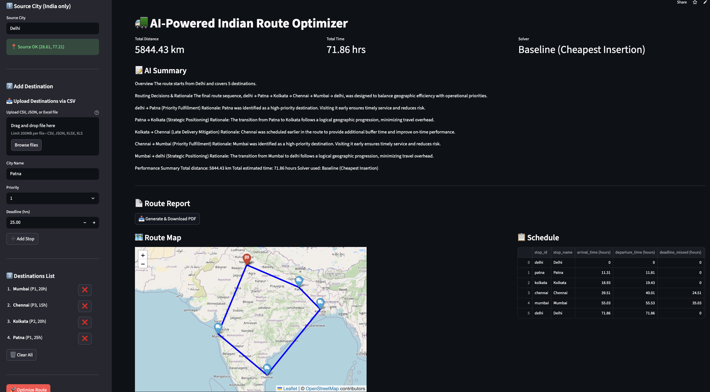
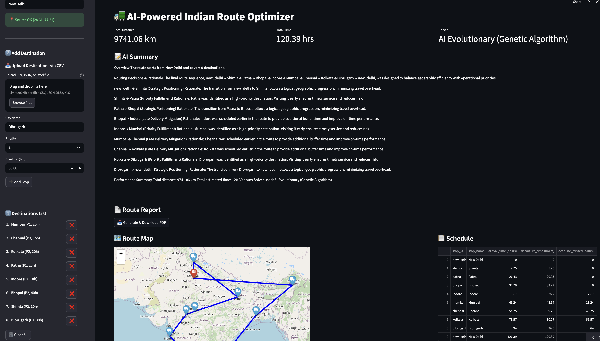
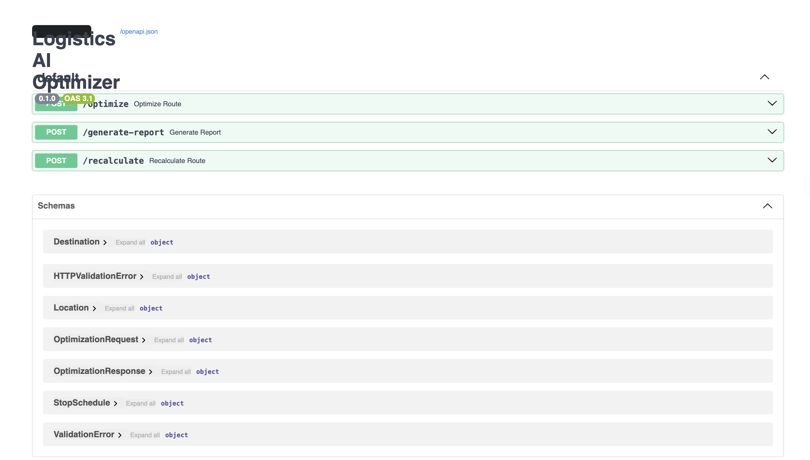
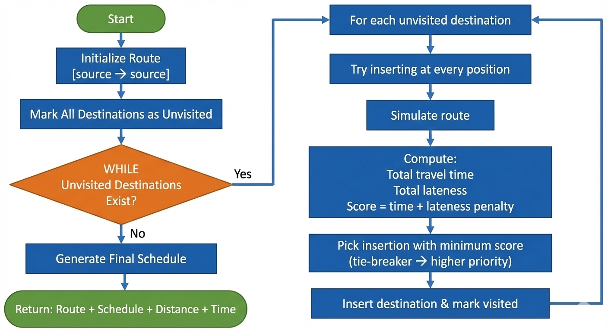
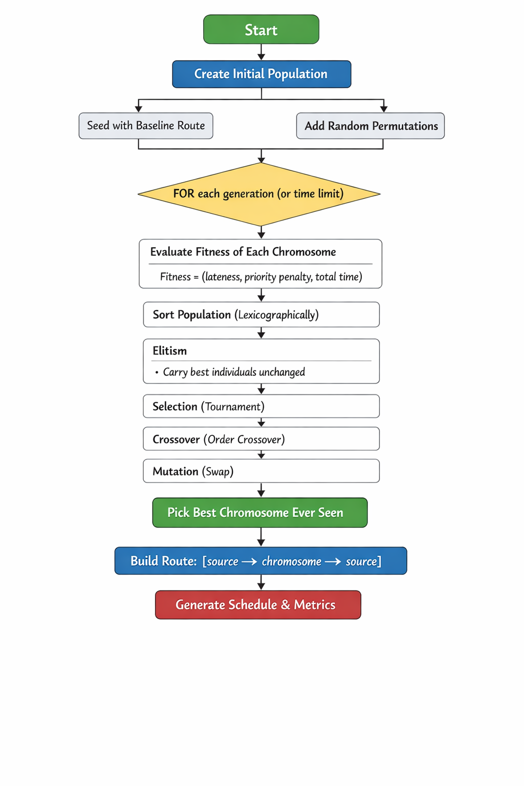
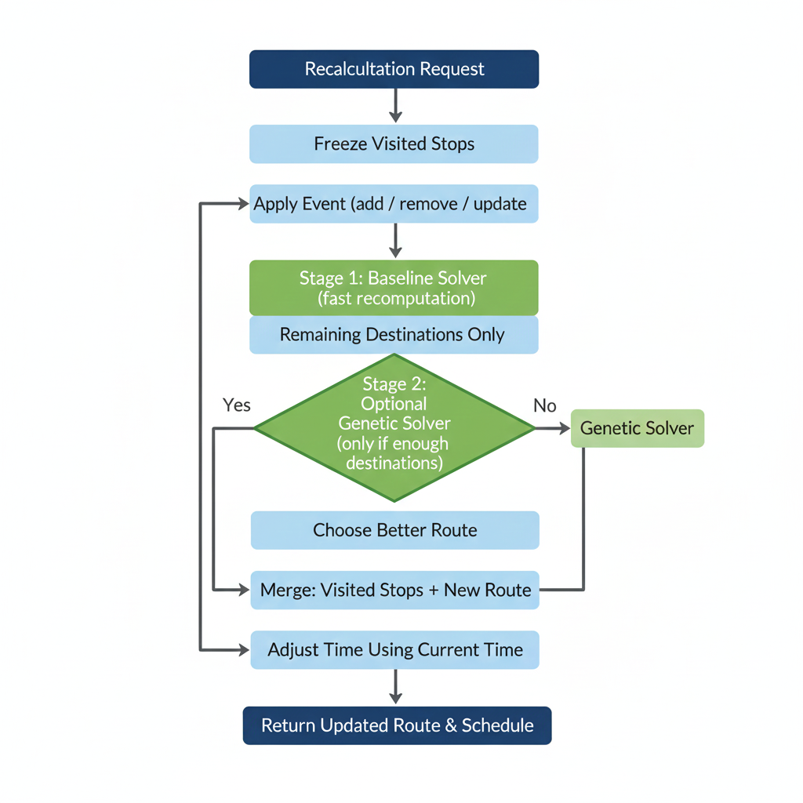

# 🚚 Flipr — AI-Powered Multi-City Route Optimizer

[](https://flipr-ai-powered-route-optimizer-nmzsqnmbxdcav9chch6mrv.streamlit.app/)
[](https://github.com/unstoppable-satyam/Flipr-AI-Powered-Route-Optimizer)

**Live demo:** [https://flipr-ai-powered-route-optimizer-nmzsqnmbxdcav9chch6mrv.streamlit.app/](https://flipr-ai-powered-route-optimizer-nmzsqnmbxdcav9chch6mrv.streamlit.app/)

**Interactive API (Swagger UI):** [https://flipr-ai-powered-route-optimizer.onrender.com/docs#/](https://flipr-ai-powered-route-optimizer.onrender.com/docs#/)

---

## 🔥 Project One-Liner
A hybrid route optimizer for Indian multi-city deliveries combining a **fast baseline heuristic** (cheapest insertion) with an **AI Genetic Algorithm**. Features include **dynamic recalculation**, **PDF reporting**, and an **interactive Streamlit + Folium dashboard**.

---


- Working example where baseline algo is good.

  

- Working example where Genetic algo is better.

## 📋 Table of Contents
- [Why this project](#-why-this-project)
- [Quick Start (Run Locally)](#-quick-start-run-locally)
- [Environment Variables](#-environment-variables-env)
- [Frontend Usage](#-frontend-usage-user-flow)
- [Input File Formats](#-input-file-formats)
- [API Overview](#-api-overview)
- [Overall System Architecture](#-overall-system-architecture)
- [Solver Logic](#-solver-logic)
- [Genetic Algorithm](#-genetic-algorithm)
- [Dynamic Recalculation Engine](#-dynamic-recalculation-engine)
- [Repository Structure](#-repository-structure--file-roles)
- [Performance Benchmarking](#-performance-benchmarking)
- [Testing & Validation](#-testing--validation)
- [Deployment Notes](#-deployment-notes)
- [Troubleshooting](#-troubleshooting)
- [Contributing & Contact](#-contributing--contact)

---

## 💡 Why This Project?
- **Real-world logistics constraints:** Handles priority levels, delivery deadlines, service times, and depot returns.
- **Hybrid optimization:** Instant results via baseline heuristic, improved quality via Genetic Algorithm.
- **Dynamic updates:** Handle live events (add/remove/update stops) while the vehicle is en route.
- **Professional outputs:** AI-generated summaries (Gemini with fallback) and downloadable PDF reports.
- **Clean visualization:** Interactive map, schedule table, and metrics dashboard.

---

## ⚡ Quick Start (Run Locally)

> **Note:** Use **Python 3.10 or 3.12**. Avoid Python 3.14 due to library incompatibilities.

### 1️⃣ Clone the repository
```bash
git clone [https://github.com/unstoppable-satyam/Flipr-AI-Powered-Route-Optimizer](https://github.com/unstoppable-satyam/Flipr-AI-Powered-Route-Optimizer)
cd Flipr-AI-Powered-Route-Optimizer

```

### 2️⃣ Create & activate a virtual environment

**macOS / Linux:**

```bash
python3.12 -m venv venv
source venv/bin/activate

```

**Windows (PowerShell):**

```powershell
python -m venv venv
.\venv\Scripts\Activate.ps1

```

### 3️⃣ Install dependencies

```bash
pip install -r requirements.txt

```

### 4️⃣ Start the backend

```bash
uvicorn main:app --reload

```

*API runs at: `http://127.0.0.1:8000*`

### 5️⃣ Start the frontend

```bash
streamlit run frontend/app.py

```

*Streamlit opens automatically in your browser.*

---

## 🔒 Environment Variables (.env)

Create a `.env` file in the project root:

```ini
ORS_API_KEY=your_openrouteservice_key_here
GEMINI_API_KEY_1=your_gemini_key_1
GEMINI_API_KEY_2=your_gemini_key_2

```

**Notes:**

* `ORS_API_KEY` is **required** for distance matrix and geocoding.
* Gemini keys are **optional**; if unavailable or quota-exhausted, the app falls back to deterministic summaries.

---

## compass Frontend Usage (User Flow)

1. **Source City:** Enter a valid Indian city (case-insensitive, alias-aware).
2. **Add Destinations:**
* Manual entry with priority (1–3) and deadline (hours).
* Upload CSV / JSON / Excel for bulk import.


3. **Review Destinations:** View, remove, or clear destinations in the sidebar list.
4. **Optimize Route:** Click `🚀 Optimize Route` to compute:
* Route sequence
* Schedule with arrival/departure times (hours)
* Total distance & time
* AI or fallback summary
* Interactive route map


5. **Download Report:** Generate a professional PDF report with summary and schedule.

---

## 📂 Input File Formats

### CSV / Excel

* **Required column:** `city`
* **Optional columns:** `priority`, `deadline_hours`

**Example:**

```csv
city,priority,deadline_hours
Jaipur,2,48
Indore,3,72
Hyderabad,1,36

```

### JSON

```json
[
  {"city": "Roorkee", "priority": 2, "deadline_hours": 1},
  {"city": "Jaipur"}
]

```

---

## 🔌 API Overview

| Method | Endpoint | Description |
| :--- | :--- | :--- |
| `POST` | [`/optimize`](https://docs.google.com/document/d/1_u02KnTo9xeRo-eycf5z3F3byjzpZrMvcqoJOyDySUM/edit?usp=sharing) | **Core optimization endpoint.** Returns route sequence, schedule, total stats, summary, and feasibility report. |
| `POST` | [`/recalculate`](https://docs.google.com/document/d/1Rm04uC8KG8WVSBmJ2qe5NwzU0aWAz8jEmp1dy3iUoc4/edit?usp=sharing) | **Dynamic route recalculation.** Supports add/remove stops and priority updates using fast repair + GA refinement. |
| `POST` | [`/generate-report`](https://docs.google.com/document/d/1_qhth1fXnk0eFHYqNmWwct5EQWXQyFdYr32AyyklRSs/edit?usp=sharing) | Generates and returns a downloadable PDF report. |

**Interactive API (Swagger UI):** [https://flipr-ai-powered-route-optimizer.onrender.com/docs#/](https://flipr-ai-powered-route-optimizer.onrender.com/docs#/)


- Backend APIs
---

## 🔁 Overall System Architecture


<details> <summary>🔍 Click to reveal flow explanation</summary>

The process begins with a Client Request for optimization. The backend receives this request and performs Auto Geocoding to convert city names into coordinates. It then calculates a Distance & Duration Matrix between all points. An IndexMap is created for efficient lookups, followed by a Feasibility Check to ensure deadlines can be met.

The core solving starts with a Baseline Solver (Cheapest Insertion).

If there are 1 or fewer destinations, the baseline result is returned immediately.

Otherwise, a Genetic Algorithm Solver is initialized, seeded with the baseline solution. The system compares the AI result with the baseline; if the AI is better, it's used. Finally, a Trip Summary is generated, and the Final Optimized Response is sent back to the client.

</details>

## 🔁 🧠 Solver Logic

Baseline Heuristic (Cheapest Insertion)
<details> <summary>🔍 Click to reveal flow explanation</summary>

This is a fast, greedy algorithm used for an initial solution or quick repairs.

Initialize Route: Starts with a route from source to source. All destinations are marked as unvisited.

Iteration Loop: While unvisited destinations exist, the algorithm iterates through each one.

Insertion Trial: For each unvisited destination, it tries inserting it at every possible position in the current route.

Simulation & Scoring: For each insertion, the route is simulated to compute total travel time and lateness. A Score is calculated (time + lateness penalty).

Selection: The insertion with the minimum score is chosen. Ties are broken by higher priority.

Update: The best insertion is made permanent, and the destination is marked as visited. The process repeats until all are visited.

Finalize: Once complete, the final schedule, route, distance, and time are returned.

</details>

## 🔁 Genetic Algorithm (AI Solver)

<details> <summary>🔍 Click to reveal flow explanation</summary>

The Genetic Algorithm is used to refine the solution and escape local optima.

Initialization: An Initial Population of routes is created. It's seeded with the baseline route and supplemented with random permutations.

Evolution Loop: The algorithm runs for a set number of generations or a time limit.

Fitness Evaluation: Each chromosome (route) is evaluated based on lateness, priority penalties, and total time.

Sorting & Elitism: The population is sorted, and the best individuals are carried over unchanged to the next generation.

Selection, Crossover & Mutation: Parents are selected via tournaments. New offspring are created using Order Crossover and then subject to Swap Mutation to introduce variation.

Result: After the loop finishes, the Best Chromosome Ever Seen is selected.

Finalize: The final route (source -> chromosome -> source) is built, and the schedule and metrics are generated.

</details>

##  🔁 Dynamic Recalculation Engine

<details> <summary>🔍 Click to reveal flow explanation</summary>

This engine handles real-time updates while a trip is in progress.

Recalculation Request: A request is received with an event (add/remove/update stop).

Freeze Visited Stops: All stops that have already been visited are locked and will not be moved.

Apply Event: The requested change is applied to the list of remaining destinations.

Stage 1 - Baseline Solver: A fast recomputation is performed on only the remaining destinations using the baseline heuristic.

Stage 2 - Optional Genetic Solver: If there are enough remaining destinations, the Genetic Solver is run to potentially improve the route further. The better route between Stage 1 and Stage 2 is chosen.

Merge & Adjust: The frozen visited stops are merged with the new optimized route for the future stops. The schedule's timing is adjusted based on the current time.

Return: The updated route and schedule are returned.

</details>


## 🗂 Repository Structure & File Roles

```text
main/
├── main.py                 # FastAPI app & API endpoints
├── models.py               # Pydantic request/response models
└── distance_matrix.py      # ORS matrix + haversine fallback

frontend/
└── app.py                  # Streamlit UI, validation, map & schedule rendering

solver/
├── baseline.py             # Cheapest insertion heuristic
└── genetic.py              # Genetic Algorithm optimizer

utils/
├── index_map.py            # ID ↔ index mapping
├── feasibility.py          # Feasibility checks
├── summary_generator.py    # Gemini-based summary with fallback
└── pdf_generator.py        # PDF report creation

tests/
├── benchmark.py            # Performance benchmarking (5/10/20+ cities)
└── edge_cases.py           # Edge case testing

```
---

## 📈 Performance Benchmarking

To ensure scalability and reliability, the system was stress-tested using two methods: **Core Algorithm Benchmarking** (to measure pure logic speed) and **End-to-End System Benchmarking** (to measure real-world API response times).

### 1. Core Algorithmic Efficiency (Offline)

This test isolates the CPU time required to solve the route, excluding network latency.

| Dataset (Cities) | Baseline Solver (ms) | Genetic Solver (ms) |
| --- | --- | --- |
| **5 Cities** | 0.05 ms | 38.07 ms |
| **10 Cities** | 0.30 ms | 55.22 ms |
| **20 Cities** | 3.47 ms | 121.95 ms |

> **Insight:** The **Baseline Solver** is nearly instantaneous (<1ms), making it perfect for real-time dynamic repairs. The **Genetic Algorithm** handles complex 20-city problems in just ~120ms.

### 2. End-to-End System Response (Live Deployment)

This test measures total response time on the deployed Render environment, including geocoding and external API calls.

| Dataset | Cities | Response Time (s) | Total Distance (km) | Solver Used |
| --- | --- | --- | --- | --- |
| **Small** | 5 | 6.85 s | 742.86 | Baseline (Cheapest Insertion) |
| **Medium** | 10 | 6.01 s | 2269.74 | Baseline (Cheapest Insertion) |
| **Large** | 20 | 8.86 s | 4821.15 | AI Evolutionary (Genetic Algorithm) |
| **XL** | 30 | 13.96 s | 7979.72 | AI Evolutionary (Genetic Algorithm) |

> **Insight:** The system scales efficiently, handling XL datasets (30 cities) in under 14 seconds. The majority of latency comes from external data fetching, which is mitigated by caching in production.

---

## 🧪 Testing & Validation

### Edge Case Validation

A separate validation script (`tests/edge_cases.py`) runs logical consistency checks to ensure the solver respects physical and operational constraints.

**Test Case 1: Physics Check (Impossible Deadlines)**

* **Scenario:** A delivery from **Delhi to Mumbai** is requested with an impossible deadline of **5.0 hours**.
* **Constraint:** At 60 km/h, the ~1400 km trip physically requires ~23 hours.
* **Result:** `✅ PASSED`. The system calculated an arrival time of **16.36 hours**, correctly identifying that the truck would be **11.36 hours late**. This proves the feasibility engine accurately prioritizes physical reality over user constraints.

**Test Case 2: Return Trip Consistency**

* **Scenario:** A route from **Delhi → Agra** is requested.
* **Constraint:** The vehicle must return to the depot after delivery.
* **Result:** `✅ PASSED`. The returned route sequence was `['delhi', 'agra', 'delhi']`, confirming the route forms a valid closed loop.

---

## ☁️ Deployment Notes

* **Backend:** Deployed on [Render](https://render.com/).
* **Frontend:** Deployed on [Streamlit Cloud](https://streamlit.io/cloud).
* **Configuration:**
* Ensure frontend `API_URL` points to the deployed backend `/optimize`.
* Set environment variables directly in the hosting platform dashboard.

---

## 🛠 Troubleshooting

* **City not accepted?** Try `City, State, India` format.
* **Gemini quota exceeded?** Summary falls back automatically to deterministic text.
* **Slow performance?** ORS matrix calls dominate execution time; caching is enabled to mitigate this.
* **404 / detail not found?** Check the frontend API endpoint URL configuration.

---

## 🤝 Contributing & Contact

Contributions are welcome via PRs and issues.

**Authors:** Satyam Kumar, Lavisha Kapoor, Pushpendra Singh, Priyanshu 

**Contact Email:** satyamsks999000@gmail.com

*Made with ❤️ for Flipr Hackathon 30.2*
